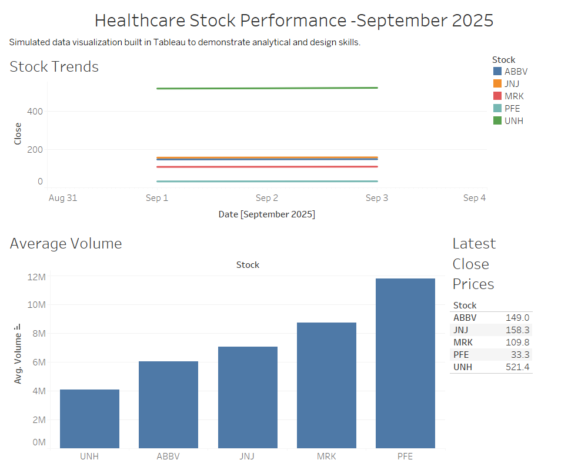

# Healthcare-stocks-dashboard
A simulated Tableau dashboard analyzing 5 healthcare stocks using fictional data for visualization practice

# 🩺 Healthcare Stock Dashboard

This project showcases an interactive Tableau dashboard analyzing **five healthcare companies** — Pfizer, Johnson & Johnson, UnitedHealth, Merck, and AbbVie — using simulated stock data.  
The goal is to demonstrate **data storytelling**, **dashboard design**, and **analytical visualization skills**.

---

### 🎯 Objective
To visualize short-term stock performance and trading volumes using fictional but realistic data.

### 🛠️ Tools Used
- Tableau Public  
- Excel / CSV Data Preparation  
- Python (for optional data generation)

### 📊 Key Visuals
- Line chart showing stock price trends  
- Bar chart for average trading volume  
- Table summarizing latest close prices  
- Interactive filters for date and company  

---

### 🖼️ Dashboard Preview

---

### 🧠 Author
**Kevin Kodawa**  
M.S. Business Analytics, University of Texas at Dallas  
